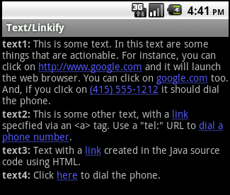
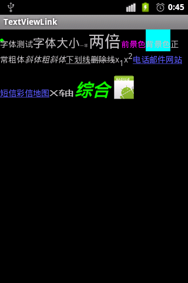

# android中用Spannable在TextView中设置超链接、颜色、字体
	<?xml version="1.0" encoding="utf-8"?>

昨晚研读 ApiDemo 源码至 com.example.android.apis.text.Link 类。首先，看一下其运行效果：

要给 TextView 加上效果，方式主要有几种：

## 第一种，自动应用效果，使用 android:autolink 属性，如：
Java代码   
        <TextView xmlns:android="http://schemas.android.com/apk/res/android"  
            android:id="@+id/text1"  
            android:layout_width="match_parent"  
            android:layout_height="match_parent"  
            android:autoLink="all"  
            android:text="@string/link_text_auto"  
            />

## 第二种，在文本中使用 <a> 标签，如：
Java代码   
        <string name="link_text_manual"><b>text2:</b> This is some other  
              text, with a <a href="http://www.google.com">link</a> specified  
              via an &lt;a&gt; tag.  Use a \"tel:\" URL  
              to <a href="tel:4155551212">dial a phone number</a>  
        </string>  

## 第三种，和第二种其实是一样的，只不过将文本改在 JAVA 代码中，如：
Java代码

        TextView t3 = (TextView) findViewById(R.id.text3);  
        t3.setText(  
            Html.fromHtml(  
                 "<b>text3:</b>  Text with a " +  
                 "<a href=\"http://www.google.com\">link</a> " +  
                 "created in the Java source code using HTML."));  
        t3.setMovementMethod(LinkMovementMethod.getInstance());  

## 第四种，前面三种可以说都是自动的，而第四种就是纯“手工”的了。通过创建 SpanableString 字符串，并在之上创 建一个或多个 Span 来实现丰富的效果。例子如下：
Java代码

        SpannableString ss = new SpannableString("text4: Click here to dial the phone.");  
        ss.setSpan(new StyleSpan(Typeface.BOLD), 0, 6,Spanned.SPAN_EXCLUSIVE_EXCLUSIVE);  
        ss.setSpan(new URLSpan("tel:4155551212"), 13, 17,Spanned.SPAN_EXCLUSIVE_EXCLUSIVE);  

        TextView t4 = (TextView) findViewById(R.id.text4);  
        t4.setText(ss);  
        t4.setMovementMethod(LinkMovementMethod.getInstance());  

完整的代码见 ApiDemo 吧，下面我提几点需要注意的：

.setMovementMethod，此方法在需要响应用户事件时使用，如点击一个电话号码就跳转到拨号页面。如果不执行这个方法是不会响应事件的，即便文本看着已经是下划线蓝色字了。
.Spanned.SPAN_EXCLUSIVE_EXCLUSIVE，这是在 setSpan 时需要指定的 flag，它的意义我试了很久也没试出来，睡个觉，今天早上才突然有点想法，试之，果然。它是用来标识在 Span 范围内的文本前后输入新的字符时是否把它们也应用这个效果。
分别有

        Spanned.SPAN_EXCLUSIVE_EXCLUSIVE(前后都不包括)
        Spanned.SPAN_INCLUSIVE_EXCLUSIVE(前面包括，后面不包括)
        Spanned.SPAN_EXCLUSIVE_INCLUSIVE(前面不包括，后面包括)
        Spanned.SPAN_INCLUSIVE_INCLUSIVE(前后都包括)。

看个截图就更明白了：

对比一下

以下转自:http://blog.csdn.net/yang_hui1986527/article/details/6776629
在Android中，TextView是我们最常用的用来显示文本的控件。

  一般情况下，TextView中的文本都是一个样式。那么如何对于TextView中各个部分的文本来设置字体，大小，颜色，样式，以及超级链接等属性呢？下面我们通过SpannableString的具体实例操作来演示一下。

res-layout-main.xml:
Java代码

        <?xml version="1.0" encoding="utf-8"?>  
        <LinearLayout xmlns:android="http://schemas.android.com/apk/res/android"  
            android:layout_height="wrap_content" android:layout_width="wrap_content" android:orientation="horizontal">  
        <TextView    
            android:id="@+id/myTextView"  
            android:layout_width="fill_parent"   
            android:layout_height="wrap_content"   
            />  
        </LinearLayout>  

res-color-color.xml

res-color-linkcolor.xml:
Java代码

        <?xml version="1.0" encoding="utf-8"?>  
        <selector  xmlns:android="http://schemas.android.com/apk/res/android">  
            <item android:state_pressed="true"  
                  android:color="#ffffff00"/> <!-- pressed -->  
            <item android:state_focused="true"  
                  android:color="#ff00ffff"/> <!-- focused -->  
            <item android:color="#ff0ff000"/> <!-- default -->  
        </selector>  

TextViewLinkActivity:
Java代码

        import java.io.IOException;  

        import org.xmlpull.v1.XmlPullParserException;  

        import android.app.Activity;  
        import android.content.res.ColorStateList;  
        import android.content.res.XmlResourceParser;  
        import android.graphics.Bitmap;  
        import android.graphics.BitmapFactory;  
        import android.graphics.Color;  
        import android.graphics.drawable.Drawable;  
        import android.os.Bundle;  
        import android.text.SpannableString;  
        import android.text.Spanned;  
        import android.text.method.LinkMovementMethod;  
        import android.text.style.AbsoluteSizeSpan;  
        import android.text.style.BackgroundColorSpan;  
        import android.text.style.BulletSpan;  
        import android.text.style.DrawableMarginSpan;  
        import android.text.style.ForegroundColorSpan;  
        import android.text.style.IconMarginSpan;  
        import android.text.style.ImageSpan;  
        import android.text.style.RelativeSizeSpan;  
        import android.text.style.ScaleXSpan;  
        import android.text.style.StrikethroughSpan;  
        import android.text.style.StyleSpan;  
        import android.text.style.SubscriptSpan;  
        import android.text.style.SuperscriptSpan;  
        import android.text.style.TextAppearanceSpan;  
        import android.text.style.TypefaceSpan;  
        import android.text.style.URLSpan;  
        import android.text.style.UnderlineSpan;  
        import android.widget.TextView;  

        public class TextViewLinkActivity extends Activity {  
        TextView mTextView = null;     
        SpannableString msp = null;    

        /** Called when the activity is first created. */  
        @Override  
        public void onCreate(Bundle savedInstanceState) {  
            super.onCreate(savedInstanceState);  
            setContentView(R.layout.main);  

            mTextView = (TextView)findViewById(R.id.myTextView);  

            //创建一个 SpannableString对象    
            msp = new SpannableString("字体测试字体大小一半两倍前景色背景色正常粗体斜体粗斜体下划线删除线x1x2电话邮件网站短信彩信地图X轴综合/bot");   

            //设置字体(default,default-bold,monospace,serif,sans-serif)  
            msp.setSpan(new TypefaceSpan("monospace"), 0, 2, Spanned.SPAN_EXCLUSIVE_EXCLUSIVE);  
            msp.setSpan(new TypefaceSpan("serif"), 2, 4, Spanned.SPAN_EXCLUSIVE_EXCLUSIVE);  

            //设置字体大小（绝对值,单位：像素）   
            msp.setSpan(new AbsoluteSizeSpan(20), 4, 6, Spanned.SPAN_EXCLUSIVE_EXCLUSIVE);  
            msp.setSpan(new AbsoluteSizeSpan(20,true), 6, 8, Spanned.SPAN_EXCLUSIVE_EXCLUSIVE);  //第二个参数boolean dip，如果为true，表示前面的字体大小单位为dip，否则为像素，同上。  

            //设置字体大小（相对值,单位：像素） 参数表示为默认字体大小的多少倍  
            msp.setSpan(new RelativeSizeSpan(0.5f), 8, 10, Spanned.SPAN_EXCLUSIVE_EXCLUSIVE);  //0.5f表示默认字体大小的一半  
            msp.setSpan(new RelativeSizeSpan(2.0f), 10, 12, Spanned.SPAN_EXCLUSIVE_EXCLUSIVE);  //2.0f表示默认字体大小的两倍  

            //设置字体前景色  
            msp.setSpan(new ForegroundColorSpan(Color.MAGENTA), 12, 15, Spanned.SPAN_EXCLUSIVE_EXCLUSIVE);  //设置前景色为洋红色  

            //设置字体背景色  
            msp.setSpan(new BackgroundColorSpan(Color.CYAN), 15, 18, Spanned.SPAN_EXCLUSIVE_EXCLUSIVE);  //设置背景色为青色  

            //设置字体样式正常，粗体，斜体，粗斜体  
            msp.setSpan(new StyleSpan(android.graphics.Typeface.NORMAL), 18, 20, Spanned.SPAN_EXCLUSIVE_EXCLUSIVE);  //正常  
            msp.setSpan(new StyleSpan(android.graphics.Typeface.BOLD), 20, 22, Spanned.SPAN_EXCLUSIVE_EXCLUSIVE);  //粗体  
            msp.setSpan(new StyleSpan(android.graphics.Typeface.ITALIC), 22, 24, Spanned.SPAN_EXCLUSIVE_EXCLUSIVE);  //斜体  
            msp.setSpan(new StyleSpan(android.graphics.Typeface.BOLD_ITALIC), 24, 27, Spanned.SPAN_EXCLUSIVE_EXCLUSIVE);  //粗斜体  

            //设置下划线  
            msp.setSpan(new UnderlineSpan(), 27, 30, Spanned.SPAN_EXCLUSIVE_EXCLUSIVE);  

            //设置删除线  
            msp.setSpan(new StrikethroughSpan(), 30, 33, Spanned.SPAN_EXCLUSIVE_EXCLUSIVE);  

            //设置上下标  
            msp.setSpan(new SubscriptSpan(), 34, 35, Spanned.SPAN_EXCLUSIVE_EXCLUSIVE);     //下标     
            msp.setSpan(new SuperscriptSpan(), 36, 37, Spanned.SPAN_EXCLUSIVE_EXCLUSIVE);   //上标              

            //超级链接（需要添加setMovementMethod方法附加响应）  
            msp.setSpan(new URLSpan("tel:4155551212"), 37, 39, Spanned.SPAN_EXCLUSIVE_EXCLUSIVE);     //电话     
            msp.setSpan(new URLSpan("mailto:webmaster@google.com"), 39, 41, Spanned.SPAN_EXCLUSIVE_EXCLUSIVE);     //邮件     
            msp.setSpan(new URLSpan("http://www.baidu.com"), 41, 43, Spanned.SPAN_EXCLUSIVE_EXCLUSIVE);     //网络     
            msp.setSpan(new URLSpan("sms:4155551212"), 43, 45, Spanned.SPAN_EXCLUSIVE_EXCLUSIVE);     //短信   使用sms:或者smsto:  
            msp.setSpan(new URLSpan("mms:4155551212"), 45, 47, Spanned.SPAN_EXCLUSIVE_EXCLUSIVE);     //彩信   使用mms:或者mmsto:  
            msp.setSpan(new URLSpan("geo:38.899533,-77.036476"), 47, 49, Spanned.SPAN_EXCLUSIVE_EXCLUSIVE);     //地图     

            //设置字体大小（相对值,单位：像素） 参数表示为默认字体宽度的多少倍  
            msp.setSpan(new ScaleXSpan(2.0f), 49, 51, Spanned.SPAN_EXCLUSIVE_EXCLUSIVE); //2.0f表示默认字体宽度的两倍，即X轴方向放大为默认字体的两倍，而高度不变  

            //设置字体（依次包括字体名称，字体大小，字体样式，字体颜色，链接颜色）  
            ColorStateList csllink = null;  
            ColorStateList csl = null;  
            XmlResourceParser xppcolor=getResources().getXml (R.color.color);  
            try {  
                    csl= ColorStateList.createFromXml(getResources(),xppcolor);  
                }catch(XmlPullParserException e){  
                    // TODO: handle exception  
                    e.printStackTrace();          
                }catch(IOException e){  
                    // TODO: handle exception  
                    e.printStackTrace();          
                }  

                XmlResourceParser xpplinkcolor=getResources().getXml(R.color.linkcolor);  
                try {  
                    csllink= ColorStateList.createFromXml(getResources(),xpplinkcolor);  
                }catch(XmlPullParserException e){  
                    // TODO: handle exception  
                    e.printStackTrace();          
                }catch(IOException e){  
                    // TODO: handle exception  
                    e.printStackTrace();          
                }  
                msp.setSpan(new TextAppearanceSpan("monospace",android.graphics.Typeface.BOLD_ITALIC, 30, csl, csllink), 51, 53, Spanned.SPAN_EXCLUSIVE_EXCLUSIVE);   

                //设置项目符号  
                msp.setSpan(new BulletSpan(android.text.style.BulletSpan.STANDARD_GAP_WIDTH,Color.GREEN), 0 ,msp.length(), Spanned.SPAN_EXCLUSIVE_EXCLUSIVE); //第一个参数表示项目符号占用的宽度，第二个参数为项目符号的颜色  

                //设置图片  
                Drawable drawable = getResources().getDrawable(R.drawable.icon);   
                drawable.setBounds(0, 0, drawable.getIntrinsicWidth(), drawable.getIntrinsicHeight());    
                msp.setSpan(new ImageSpan(drawable), 53, 57, Spanned.SPAN_EXCLUSIVE_EXCLUSIVE);  

                mTextView.setText(msp);  
                mTextView.setMovementMethod(LinkMovementMethod.getInstance());   
            }  
        }  

效果预览：

